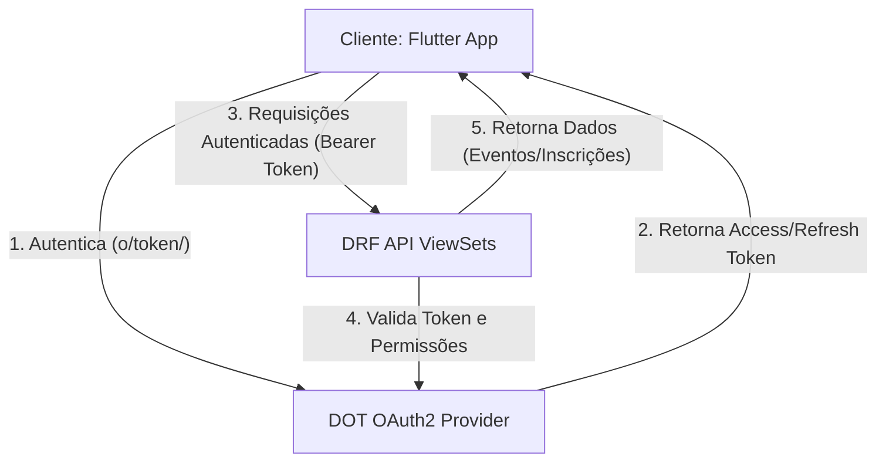

# Plano de Implementação: MeetFlow com API RESTful Segura (OAuth2)

Este plano descreve detalhadamente as etapas necessárias para atender aos requisitos do Trabalho Final de Programação para Web I, integrando o backend Django/DRF ao Django OAuth Toolkit (DOT) e concluindo o desenvolvimento do cliente móvel Flutter ([client](file:///home/maiko/Projects/MeetFlow-Fork/client)).

---

## 📋 1. Visão Geral dos Requisitos



O projeto deve conter:
- **API (Django/DRF)**: Autenticação via DOT, mínimo de 3 models relacionados, CRUD completo para o model principal (`Evento` ou `Inscricao`) e uso adequado de serializers.
- **Cliente (Flutter)**: Implementação em tecnologia que não seja Django, realizando login, obtendo token de acesso OAuth2, armazenando o token com segurança e consumindo rotas protegidas.

---

## 🛠️ 2. Etapa 1: Backend Django & DRF

### 2.1. Configuração de Dependências
1. Adicionar `django-oauth-toolkit` ao arquivo [pyproject.toml](file:///home/maiko/Projects/MeetFlow-Fork/api/pyproject.toml) e ao [requirements.txt](file:///home/maiko/Projects/MeetFlow-Fork/api/requirements.txt).
2. Instalar a nova dependência no ambiente virtual:
   ```bash
   pip install django-oauth-toolkit
   ```

### 2.2. Atualização das Configurações ([meetflow/settings.py](file:///home/maiko/Projects/MeetFlow-Fork/api/meetflow/settings.py))
1. Adicionar `'oauth2_provider'` à lista de `INSTALLED_APPS`.
2. Configurar o framework REST para usar a autenticação OAuth2 do DOT por padrão:
   ```python
   REST_FRAMEWORK = {
       'DEFAULT_AUTHENTICATION_CLASSES': (
           'oauth2_provider.contrib.rest_framework.OAuth2Authentication',
           'rest_framework.authentication.SessionAuthentication', # para o painel admin/web
       ),
       'DEFAULT_PERMISSION_CLASSES': (
           'rest_framework.permissions.IsAuthenticated', # Rota protegida por padrão
       ),
       'DEFAULT_PAGINATION_CLASS': 'rest_framework.pagination.PageNumberPagination',
       'PAGE_SIZE': 2,
   }
   ```
3. Adicionar o middleware do OAuth2 na lista de `MIDDLEWARE` se for necessário expor login via formulários web:
   ```python
   MIDDLEWARE = [
       ...
       'oauth2_provider.middleware.OAuth2TokenMiddleware',
       ...
   ]
   ```

### 2.3. Roteamento de URLs ([meetflow/urls.py](file:///home/maiko/Projects/MeetFlow-Fork/api/meetflow/urls.py))
Incluir as rotas padrão do Django OAuth Toolkit para permitir a geração e revogação de tokens:
```python
urlpatterns = [
    path('admin/', admin.site.urls),
    path('o/', include('oauth2_provider.urls', namespace='oauth2')),
    path('api/', include(router.urls)),
    ...
]
```

### 2.4. Migração e Banco de Dados
Executar as migrações para criar as tabelas necessárias para o gerenciamento de tokens e aplicações do DOT:
```bash
python manage.py migrate
```

### 2.5. Autocriação da Aplicação OAuth
Para facilitar o setup e desenvolvimento, criar um script ou comando administrativo em Django para gerar automaticamente a aplicação móvel OAuth2 sem depender do painel administrativo:
- **Nome**: `MeetFlow Mobile Client`
- **Client ID**: `meetflow-mobile-client`
- **Client Type**: `Public` (apropriado para apps móveis pois não guardam segredos com segurança)
- **Authorization Grant Type**: `Resource Owner Password Credentials` (ou `password`, que permite o envio direto de username e password do app para o endpoint `/o/token/`)

---

## 📱 3. Etapa 2: Cliente Flutter (`client`)

O aplicativo precisa ser ajustado para trocar o método de autenticação de **Basic Auth** para **OAuth2 Bearer Token**.

### 3.1. Armazenamento de Tokens ([storage_service.dart](file:///home/maiko/Projects/MeetFlow-Fork/client/lib/services/storage_service.dart))
Modificar o serviço de persistência segura para armazenar tokens OAuth em vez da senha do usuário em texto puro:
- Adicionar chaves para `access_token` e `refresh_token`.
- Criar métodos para salvar, ler e expirar os tokens:
  ```dart
  Future<void> saveTokens(String accessToken, String? refreshToken) async { ... }
  Future<String?> getAccessToken() async { ... }
  Future<String?> getRefreshToken() async { ... }
  Future<void> clearTokens() async { ... }
  ```

### 3.2. Interceptador de Requisições ([api_service.dart](file:///home/maiko/Projects/MeetFlow-Fork/client/lib/services/api_service.dart))
Atualizar o interceptador do `Dio` para anexar o token de acesso como cabeçalho `Bearer`:
```dart
onRequest: (options, handler) async {
  options.baseUrl = await _storageService.getBaseUrl();
  final token = await _storageService.getAccessToken();
  if (token != null) {
    options.headers['Authorization'] = 'Bearer $token';
  }
  return handler.next(options);
}
```

### 3.3. Fluxo de Autenticação ([login_viewmodel.dart](file:///home/maiko/Projects/MeetFlow-Fork/client/lib/viewmodels/login_viewmodel.dart))
Alterar o método `login` para realizar uma chamada `POST` ao endpoint de tokens (`/o/token/`):
- **Parâmetros da requisição**:
  ```json
  {
    "grant_type": "password",
    "username": "user",
    "password": "password",
    "client_id": "meetflow-mobile-client"
  }
  ```
- Se a resposta for bem-sucedida (status `200` contendo `access_token`), persistir o token usando o `StorageService` e buscar o perfil do usuário logado (`/api/users/me/`) para carregar suas informações e permissões.

### 3.4. Implementação de Telas e Funcionalidades Pendentes
1. **Detalhes do Evento**:
    - Criar a tela de detalhes de um evento acessada a partir de [event_list_view.dart](file:///home/maiko/Projects/MeetFlow-Fork/client/lib/views/event_list_view.dart).
   - Adicionar botão **"Inscrever-se"** que realiza um `POST` no endpoint `/api/inscricoes/` enviando o `evento` e o `participante` logado.
2. **Minhas Inscrições**:
   - Criar uma tela dedicada (ou aba) para exibir eventos em que o usuário está inscrito (filtrando `/api/inscricoes/` pelo ID do participante).
   - Implementar a opção de **"Cancelar Inscrição"** (que executa um `DELETE` ou altera o status da inscrição para `cancelado` via `PATCH`).
3. **Visões de Organizador/Admin**:
   - Verificar no perfil do usuário (`Usuario.tipo`) se ele é `organizador` ou `admin`.
   - Se for, habilitar o botão para **Criar Evento** (`POST /api/eventos/`).
   - Implementar tela de **Controle de Presença** permitindo que o organizador visualize os inscritos e marque presença (`POST /api/presencas/` ou atualização de presença existente).
   - Implementar tela de **Relatórios** de eventos consumindo o endpoint `/api/relatorios/`.

---

## 📽️ 4. Etapa 3: Entrega, Documentação e Vídeo

### 4.1. Estruturação do Repositório
Para atender à regra de entrega, a estrutura do repositório deve estar claramente dividida:
- O backend Django deve ser mapeado/movido (ou referenciado claramente) como pasta `/api`.
- O cliente Flutter ([client](file:///home/maiko/Projects/MeetFlow-Fork/client)) deve estar mapeado/movido como pasta `/client` (ou mantido como submódulo e referenciado com instruções claras no root). 
- *Nota*: A forma mais simples de cumprir a regra `/api` e `/client` mantendo os submódulos é configurar links simbólicos ou renomear as pastas de acordo com as exigências.

### 4.2. Documentação no README.md
O [README.md](file:///home/maiko/Projects/MeetFlow-Fork/README.md) principal deve ser atualizado para incluir:
1. Instruções para rodar a API (instalação de dependências, migrações, criação de superusuário e execução do servidor).
2. Instruções para inicializar a aplicação cliente Flutter (configuração do Flutter SDK, comando `flutter pub get`, e execução no emulador ou dispositivo).
3. Passo a passo para configurar o cliente OAuth no Django para que o aplicativo consiga realizar o fluxo de login.

### 4.3. Roteiro Recomendado para o Vídeo (Máx 10 minutos)
O vídeo de demonstração deve cobrir:
1. **Apresentação do Escopo**: Apresentação dos integrantes e do objetivo da aplicação.
2. **Demonstração do Fluxo DOT**:
   - Mostrar o console/banco de dados ou painel administrativo do Django confirmando a presença da aplicação registrada.
   - Mostrar no terminal ou ferramenta de requisição (Postman/Curl) um teste do fluxo de obtenção do token OAuth2 com credenciais inválidas e válidas.
3. **Interação Cliente ↔ API (App Flutter)**:
   - Inicializar o aplicativo móvel.
   - Realizar login com um usuário participante e demonstrar a obtenção do token.
   - Acessar a listagem de eventos (rota protegida).
   - Realizar uma inscrição em um evento (CRUD de inscrição).
   - Realizar logout, mostrando que o token foi limpo e o acesso às rotas protegidas foi bloqueado.
   - (Se implementado) Login com organizador/admin demonstrando a criação de eventos e relatórios.
