# Roteiro de Apresentação (Script do Vídeo) - MeetFlow

Este roteiro foi estruturado para uma apresentação de até **10 minutos**, focando nos critérios de avaliação: **Segurança/DOT (40%)**, **Funcionalidade da API (30%)**, **Cliente Flutter (20%)** e **Documentação/Organização (10%)**.

---

## ⏱️ Cronograma e Divisão de Tempo

```mermaid
gantt
    title Divisão do Tempo do Vídeo (10 minutos)
    dateFormat  X
    axisFormat %M:%S
    section Roteiro
    01. Introdução e Contexto (1m)         :active, des1, 0, 60
    02. Segurança e DOT no Terminal (3m)    :des2, 60, 240
    03. Demonstração do App Flutter (4m)    :des3, 240, 480
    04. Revisão Rápida de Código (1.5m)    :des4, 480, 570
    05. Conclusão e Encerramento (0.5m)    :des5, 570, 600
```



---

## 🎤 Script Detalhado: Passo a Passo

### Parte 1: Introdução e Contexto (00:00 - 01:00)
* **O que mostrar na tela**: Página inicial do repositório no GitHub ou slide de apresentação com o logo do MeetFlow e os nomes dos integrantes do grupo.
* **Quem fala**: Integrante 1

> **[Fala do Apresentador 1]**
> *"Olá a todos! Eu sou o [Seu Nome], e junto com meus colegas [Nome do Colega 2] e [Nome do Colega 3], vamos apresentar o Trabalho Final de Programação para Web I, ministrado pelo professor Carlos Anderson. 
> 
> O objetivo deste trabalho é desenvolver uma API RESTful completa e segura utilizando o Django REST Framework integrada com o Django OAuth Toolkit para autenticação OAuth2, consumida por um cliente móvel desenvolvido em Flutter. 
> 
> O nosso sistema se chama **MeetFlow**, uma plataforma de gestão de eventos acadêmicos e corporativos. Vamos mostrar agora como funciona a nossa arquitetura de segurança, o fluxo de tokens, a interface do aplicativo móvel consumindo essa API em tempo real e os principais pontos do código."*

---

### Parte 2: Segurança, DOT e Testes de Endpoint (01:00 - 04:00)
* **O que mostrar na tela**: Painel administrativo do Django `/admin/` (na seção de Applications do Django OAuth Toolkit) e, em seguida, um terminal ou cliente HTTP (como Postman ou Insomnia).
* **Quem fala**: Integrante 2 (ou Integrante 1)

> **[Ação em Tela]**: Abrir o navegador no Django Admin na tabela de `Applications` e abrir um terminal para fazer requisições `curl`.

> **[Fala do Apresentador 2]**
> *"Para garantir a segurança da API do MeetFlow, optamos por utilizar o fluxo **Resource Owner Password Credentials** do protocolo OAuth 2.0. Isso é ideal para o nosso cliente mobile, onde o usuário insere as credenciais diretamente no aplicativo, que por sua vez solicita o token à API.
> 
> Aqui no painel administrativo do Django, podemos ver a nossa aplicação cadastrada: **MeetFlow Mobile App**. Ela foi configurada com o ID de cliente `meetflow-mobile-client`, tipo de cliente `Public` (apropriado para apps móveis) e tipo de autorização `Resource Owner Password Credentials`.
> 
> Vamos demonstrar essa autenticação diretamente no terminal simulando a requisição do aplicativo cliente."*

> **[Ação em Tela]**: No terminal, executar um comando `curl` com uma senha incorreta:
> ```bash
> curl -X POST -d "grant_type=password&username=admin&password=senha_errada&client_id=meetflow-mobile-client" http://localhost:8000/o/token/
> ```
> *Mostrar o retorno de erro `400 Bad Request` com o JSON contendo `"error": "invalid_grant"`.*

> **[Fala do Apresentador 2]**
> *"Se tentarmos obter um token enviando credenciais incorretas, a API retorna um erro de segurança `400 Bad Request` com a mensagem `invalid_grant`, impedindo o acesso.
> 
> Agora, vamos enviar a requisição com as credenciais corretas do nosso administrador."*

> **[Ação em Tela]**: Executar o comando com a senha correta:
> ```bash
> curl -X POST -d "grant_type=password&username=admin&password=password123&client_id=meetflow-mobile-client" http://localhost:8000/o/token/
> ```
> *Destacar no terminal o JSON de resposta contendo o `access_token`, `refresh_token`, `expires_in` e `token_type: Bearer`.*

> **[Fala do Apresentador 2]**
> *"Com as credenciais corretas, o Django OAuth Toolkit gera com sucesso o nosso Token de Acesso (`access_token`) e o Token de Atualização (`refresh_token`). A partir deste momento, o cliente usará este Bearer Token para acessar todos os endpoints protegidos da nossa API."*

---

### Parte 3: Demonstração do Aplicativo Cliente - Flutter (04:00 - 08:00)
* **O que mostrar na tela**: Emulador Android ou iOS rodando o `client`.
* **Quem fala**: Integrante 3 (ou Integrante 2)

> **[Ação em Tela]**: Mostrar a tela de login do aplicativo no emulador, com o campo de Base URL preenchido (`http://10.0.2.2:8000/api/` ou o IP local da máquina).

> **[Fala do Apresentador 3]**
> *"Agora vamos ver a integração prática acontecendo no nosso cliente móvel desenvolvido em Flutter. 
> Esta é a tela de login do MeetFlow. O app permite configurar a URL da API dinamicamente para facilitar os testes em diferentes ambientes.
> 
> Primeiramente, vou tentar fazer login com dados inválidos."*

> **[Ação em Tela]**: Digitar um usuário inexistente e clicar em Login. Mostrar o aviso de erro vermelho na tela. Em seguida, preencher com o usuário `user1` e a senha `password123` e clicar em Login.
> *O aplicativo autentica e navega para a lista de eventos.*

> **[Fala do Apresentador 3]**
> *"Ao fazer login com sucesso, o aplicativo realiza a requisição HTTP POST para a API de segurança, obtém os tokens OAuth2 e os armazena de forma criptografada e segura no dispositivo usando o Keychain ou Keystore. 
> 
> Logo em seguida, ele busca o perfil do usuário logado através do endpoint protegido `/api/users/me/` para identificar o tipo de usuário e permissões.
> 
> Esta tela que vocês veem agora é a nossa lista de eventos cadastrados na API. Ela é uma rota protegida por token. Reparem que o app implementa paginação com rolagem infinita. Conforme rolamos a tela, novos eventos são carregados sob demanda em blocos de 2 itens, respeitando as configurações de paginação do Django REST Framework."*

> **[Ação em Tela]**: Rolar a lista um pouco para demonstrar o carregamento dinâmico (Infinite Scroll). Em seguida, clicar em um evento (por exemplo: "Workshop Python") para abrir os detalhes.

> **[Fala do Apresentador 3]**
> *"Ao clicar em um evento, somos levados para a tela de **Detalhes do Evento**. Aqui, o aplicativo faz uma requisição passando o Bearer Token para verificar se este participante já possui alguma inscrição para este evento na API.
> 
> Como o usuário atual não está inscrito, aparece o botão roxo **'Inscrever-se'**. Vou clicar nele."*

> **[Ação em Tela]**: Clicar em "Inscrever-se". O status deve mudar na hora para "Inscrição: PENDENTE".
> *Navegar para trás, clicar no botão de "Minhas Inscrições" (ícone de prancheta/check no canto superior direito).*

> **[Fala do Apresentador 3]**
> *"Inscrição solicitada com sucesso! A requisição `POST` foi enviada à tabela de inscrições. 
> Agora vamos acessar a tela de **Minhas Inscrições**, que lista todos os eventos em que eu me inscrevi. Para cada item da lista, o aplicativo realiza a amarração com os detalhes do evento em tempo real.
> 
> Caso eu decida não participar mais, posso clicar no ícone de lixeira para cancelar a inscrição."*

> **[Ação em Tela]**: Clicar na lixeira ao lado da inscrição recente, confirmar a caixa de diálogo "Deseja realmente cancelar..." clicando em Sim. A inscrição some da tela.
> *Voltar para a tela inicial de eventos e clicar em Logout (botão de saída no canto superior direito). O app deve voltar para a tela de login.*

> **[Fala do Apresentador 3]**
> *"Ao cancelar, uma requisição `DELETE` é enviada à API, removendo a inscrição de forma segura. 
> Por fim, ao efetuar o Logout, o app limpa todos os tokens do armazenamento seguro do aparelho. Se tentarmos voltar ou fazer qualquer requisição sem o token, a API bloqueia o acesso imediatamente, provando a eficácia da autenticação."*

---

### Parte 4: Análise de Código e Destaques Técnicos (08:00 - 09:30)
* **O que mostrar na tela**: VS Code exibindo o código-fonte da API Django e do aplicativo Flutter.
* **Quem fala**: Qualquer integrante

> **[Ação em Tela]**: Mostrar o arquivo [settings.py](file:///home/maiko/Projects/MeetFlow-Fork/api/meetflow/settings.py) (focando na configuração do REST_FRAMEWORK e INSTALLED_APPS) e depois o arquivo [api_service.dart](file:///home/maiko/Projects/MeetFlow-Fork/client/lib/services/api_service.dart).

> **[Fala do Apresentador]**
> *"Para fechar a parte técnica, vamos dar uma olhada rápida no código.
> No arquivo `settings.py` do Django, configuramos o DRF para utilizar a autenticação do Django OAuth Toolkit por padrão por meio da classe `OAuth2Authentication`. As rotas `/o/` foram incluídas no arquivo `urls.py` principal.
> 
> No lado do cliente em Flutter, o destaque técnico é o nosso arquivo `api_service.dart`. Nós implementamos um interceptor do pacote `Dio`. 
> No `onRequest`, ele verifica se existe um Token de Acesso no armazenamento seguro e o anexa automaticamente no cabeçalho HTTP como `Authorization: Bearer <token>`.
> 
> Além disso, adicionamos uma lógica automatizada de renovação no `onError`. Se qualquer requisição falhar com código HTTP `401 Unauthorized` devido à expiração do Token de Acesso, o interceptor intercepta o erro, faz uma chamada de refresh com o `refresh_token`, salva os novos tokens gerados e repete a chamada original sem que o usuário perceba qualquer interrupção na experiência."*

---

### Parte 5: Conclusão e Encerramento (09:30 - 10:00)
* **O que mostrar na tela**: Câmera dos integrantes (se gravada) ou o README.md do repositório contendo todas as instruções de execução detalhadas.
* **Quem fala**: Todos os integrantes ou o palestrante principal.

> **[Fala do Apresentador]**
> *"Com isso, cumprimos todos os requisitos obrigatórios do trabalho final:
> 1. Uma API RESTful segura com Django, DRF e Django OAuth Toolkit.
> 2. Mais de três modelos relacionados no banco de dados e CRUD de Inscrições.
> 3. Um cliente móvel robusto em outra linguagem (Dart/Flutter) implementando fluxo de login OAuth2 e consumo de rotas autenticadas.
> 4. Toda a documentação e instruções de execução descritas detalhadamente no README.md do projeto.
> 
> Agradecemos a atenção do professor e de todos os colegas. Muito obrigado!"*

---

## 💡 Dicas de Ouro para a Gravação do Vídeo

1. **Ajuste de Tela**: No VS Code, aumente o tamanho da fonte (`Ctrl +` ou `Cmd +`) para ficar legível no vídeo.
2. **Qualidade de Áudio**: Grave em um local silencioso e use fones de ouvido com microfone próximo à boca para evitar eco.
3. **Fluidez na Navegação**: Antes de gravar, certifique-se de que o container do Docker esteja rodando e que o emulador consiga se conectar ao backend. Um teste rápido antes evita travamentos na hora da gravação.
4. **Respeite o Tempo**: O vídeo **não pode passar de 10 minutos**. Pratique o roteiro uma vez antes para marcar o tempo.
5. **Divisão Dinâmica**: Se gravarem separados, cada integrante pode gravar a sua parte usando softwares como OBS Studio ou Zoom, e depois juntar as partes usando um editor de vídeo simples.
